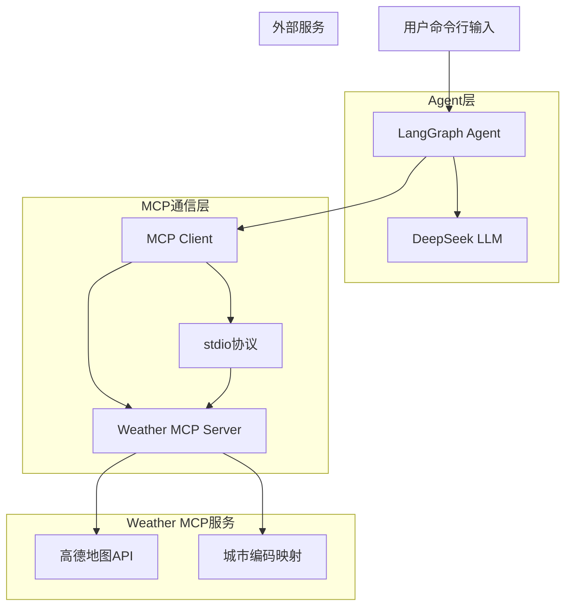
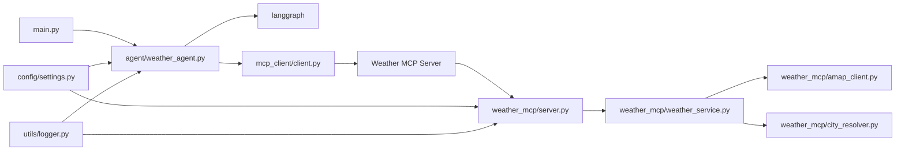
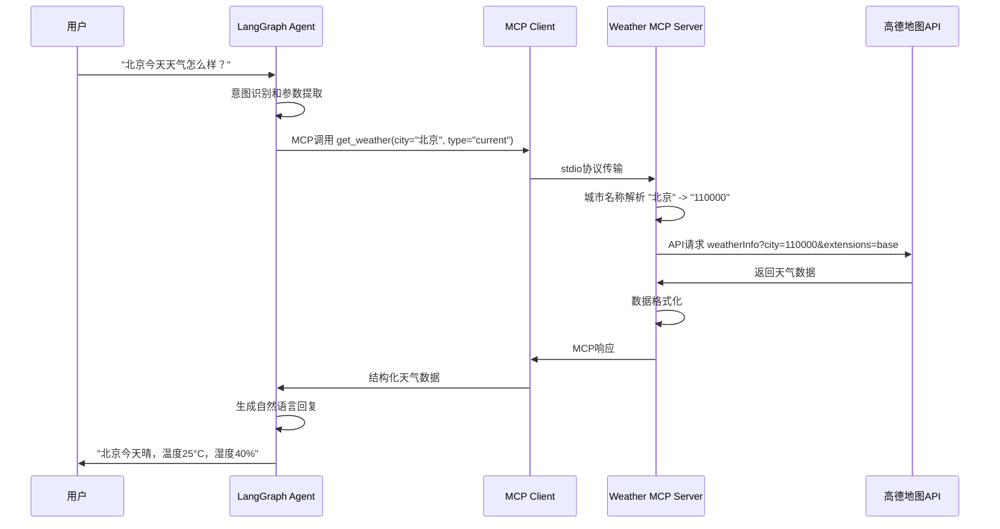

# 天气查询Agent系统架构设计文档

## 1. 整体架构图



## 2. 分层设计和核心组件

### 2.1 用户交互层
- **命令行界面**: 处理用户输入和结果展示
- **对话管理**: 维护对话上下文和状态

### 2.2 Agent智能层
- **LangGraph Agent**: 核心对话流程控制
- **DeepSeek集成**: 自然语言理解和生成
- **意图识别**: 识别天气查询意图和参数提取

### 2.3 MCP通信层
- **MCP Client**: 与Weather MCP Server通信
- **协议处理**: stdio协议封装和解析
- **错误处理**: 通信异常处理和重试

### 2.4 Weather MCP服务层
- **MCP Server**: 标准MCP协议实现
- **天气查询引擎**: 核心业务逻辑
- **城市解析器**: 城市名称智能匹配
- **API适配器**: 高德地图API调用封装

### 2.5 数据访问层
- **高德API客户端**: HTTP请求封装
- **城市编码映射**: 城市名称到编码的转换
- **缓存机制**: API结果缓存

## 3. 模块依赖关系图



## 4. 接口契约定义

### 4.1 MCP协议接口

#### Tools定义
```json
{
  "name": "get_weather",
  "description": "查询指定城市的天气信息",
  "inputSchema": {
    "type": "object",
    "properties": {
      "city": {
        "type": "string",
        "description": "城市名称，支持中文名称和模糊匹配"
      },
      "type": {
        "type": "string",
        "enum": ["current", "forecast"],
        "description": "查询类型：current为实况天气，forecast为预报天气"
      }
    },
    "required": ["city"]
  }
}
```

#### 响应格式
```json
{
  "weather_data": {
    "city": "北京市朝阳区",
    "province": "北京市",
    "adcode": "110105",
    "type": "current",
    "data": {
      "weather": "晴",
      "temperature": "25",
      "humidity": "40",
      "wind_direction": "西北",
      "wind_power": "3",
      "report_time": "2025-01-16 10:00:00"
    }
  }
}
```

### 4.2 内部服务接口

#### 城市解析接口
```python
class CityResolver:
    def resolve_city(self, city_name: str) -> CityInfo:
        """解析城市名称到标准城市信息"""
        pass
    
    def fuzzy_match(self, city_name: str) -> List[CityInfo]:
        """模糊匹配城市名称"""
        pass
```

#### 天气服务接口
```python
class WeatherService:
    def get_current_weather(self, adcode: str) -> CurrentWeather:
        """获取实况天气"""
        pass
    
    def get_forecast_weather(self, adcode: str) -> ForecastWeather:
        """获取预报天气"""
        pass
```

## 5. 数据流向图



## 6. 异常处理策略

### 6.1 API异常处理
- **网络超时**: 3次重试，指数退避
- **API限流**: 缓存结果，降低请求频率
- **认证失败**: 记录错误，提示检查API Key
- **数据格式错误**: 数据验证，返回友好错误信息

### 6.2 MCP通信异常
- **进程启动失败**: 自动重启MCP服务器
- **通信中断**: 重新建立连接
- **协议错误**: 详细日志记录，优雅降级

### 6.3 城市解析异常
- **城市不存在**: 提供相似城市建议
- **多个匹配**: 返回候选列表供用户选择
- **编码缺失**: 使用城市中文名称作为备选

## 7. 性能优化设计

### 7.1 缓存策略
- **API结果缓存**: 实况天气缓存10分钟，预报天气缓存1小时
- **城市编码缓存**: 内存缓存，程序启动时加载
- **LRU淘汰**: 限制缓存大小，自动淘汰旧数据

### 7.2 并发控制
- **API限流**: 控制并发请求数量
- **连接池**: 复用HTTP连接
- **异步处理**: 非阻塞IO操作

## 8. 安全设计

### 8.1 API Key管理
- **环境变量**: 通过.env文件配置
- **权限控制**: 文件权限限制
- **日志脱敏**: 不在日志中记录完整API Key

### 8.2 输入验证
- **参数校验**: 严格验证输入参数
- **SQL注入防护**: 虽然不使用数据库，但防止类似攻击
- **长度限制**: 限制输入字符串长度

## 9. 监控和日志

### 9.1 日志策略
- **分级日志**: DEBUG/INFO/WARN/ERROR
- **结构化日志**: JSON格式，便于分析
- **日志轮转**: 按大小和时间轮转

### 9.2 监控指标
- **API调用次数**: 统计调用频率
- **响应时间**: 监控性能指标
- **错误率**: 统计各类错误比例
- **缓存命中率**: 优化缓存策略

## 10. 部署架构

### 10.1 进程模型
```
┌─────────────────┐    stdio    ┌──────────────────┐
│  LangGraph      │◄──────────►│  Weather MCP     │
│  Agent Process  │             │  Server Process  │
└─────────────────┘             └──────────────────┘
```

### 10.2 配置管理
- **环境配置**: 开发/测试/生产环境隔离
- **参数配置**: 可配置的超时时间、重试次数等
- **动态配置**: 支持运行时配置更新

## 11. 扩展性设计

### 11.1 插件化架构
- **天气源扩展**: 支持接入其他天气API
- **功能扩展**: 支持添加新的查询类型
- **协议扩展**: 支持其他MCP工具

### 11.2 国际化准备
- **多语言支持**: 预留国际化接口
- **时区处理**: 支持不同时区的时间显示
- **单位转换**: 支持不同的温度和风速单位