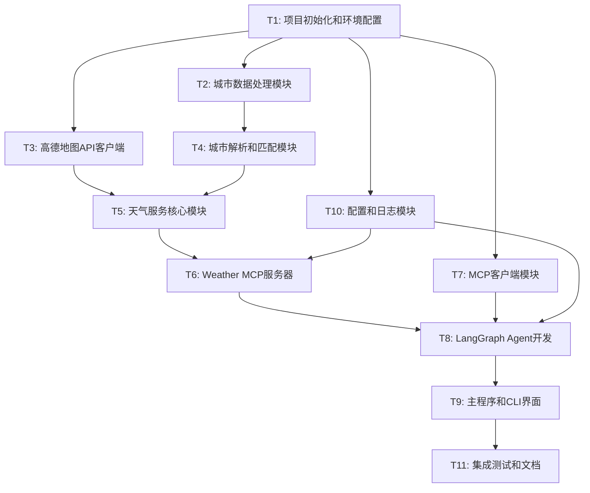

# 天气查询Agent项目任务拆分文档

## 任务依赖图

## 原子任务详细定义

### T1: 项目初始化和环境配置

**输入契约**:

* 前置依赖: 无

* 输入数据: 项目需求文档

* 环境依赖: Python 3.8+, pip/poetry

**输出契约**:

* 输出数据: 项目目录结构

* 交付物:

  * `pyproject.toml` 或 `requirements.txt`

  * `.env.example` 模板文件

  * `.gitignore` 文件

  * 基础目录结构

* 验收标准:

  * 项目可以正常安装依赖

  * 环境变量模板完整

  * 目录结构符合设计文档

**实现约束**:

* 技术栈: Python 3.8+, poetry推荐

* 接口规范: 标准Python项目结构

* 质量要求: 依赖版本锁定，安全配置

**依赖关系**:

* 后置任务: T2, T3, T7, T10

* 并行任务: 无

***

### T2: 城市数据处理模块

**输入契约**:

* 前置依赖: T1完成

* 输入数据: 高德地图城市编码Excel文件

* 环境依赖: pandas, openpyxl

**输出契约**:

* 输出数据: 城市编码映射数据结构

* 交付物:

  * `weather_mcp/data/city_data.py` - 城市数据加载器

  * `weather_mcp/models/city.py` - 城市数据模型

  * 处理后的城市数据文件(JSON格式)

* 验收标准:

  * 能够加载Excel文件并转换为内存数据结构

  * 支持按省市区县层级查询

  * 数据完整性验证通过

**实现约束**:

* 技术栈: Python, pandas, pydantic

* 接口规范: 提供统一的数据访问接口

* 质量要求: 数据验证，异常处理

**依赖关系**:

* 后置任务: T4

* 并行任务: T3

***

### T3: 高德地图API客户端

**输入契约**:

* 前置依赖: T1完成

* 输入数据: 高德地图API文档规范

* 环境依赖: httpx, pydantic

**输出契约**:

* 输出数据: 标准化的天气数据

* 交付物:

  * `weather_mcp/clients/amap_client.py` - API客户端

  * `weather_mcp/models/weather.py` - 天气数据模型

  * 单元测试文件

* 验收标准:

  * 支持实况天气和预报天气查询

  * 完善的错误处理和重试机制

  * API响应数据正确解析

**实现约束**:

* 技术栈: httpx异步HTTP客户端, pydantic数据验证

* 接口规范: 遵循高德地图API规范

* 质量要求: 异步支持，连接池，超时控制

**依赖关系**:

* 后置任务: T5

* 并行任务: T2

***

### T4: 城市解析和匹配模块

**输入契约**:

* 前置依赖: T2完成

* 输入数据: 城市数据结构，用户输入的城市名称

* 环境依赖: difflib, jieba(可选)

**输出契约**:

* 输出数据: 标准化的城市信息

* 交付物:

  * `weather_mcp/services/city_resolver.py` - 城市解析器

  * 模糊匹配算法实现

  * 单元测试文件

* 验收标准:

  * 支持精确匹配和模糊匹配

  * 支持省市区县多级匹配

  * 匹配准确率 > 90%

**实现约束**:

* 技术栈: Python标准库, 可选中文分词

* 接口规范: 统一的城市解析接口

* 质量要求: 高匹配准确率，性能优化

**依赖关系**:

* 后置任务: T5

* 并行任务: 无

***

### T5: 天气服务核心模块

**输入契约**:

* 前置依赖: T3, T4完成

* 输入数据: 城市信息，查询类型

* 环境依赖: 缓存库(可选redis-py)

**输出契约**:

* 输出数据: 格式化的天气信息

* 交付物:

  * `weather_mcp/services/weather_service.py` - 天气服务

  * 缓存机制实现

  * 单元测试文件

* 验收标准:

  * 集成城市解析和API调用

  * 缓存机制正常工作

  * 响应时间 < 3秒

**实现约束**:

* 技术栈: Python, 内存缓存或Redis

* 接口规范: 统一的天气查询接口

* 质量要求: 缓存策略，异常处理

**依赖关系**:

* 后置任务: T6

* 并行任务: 无

***

### T6: Weather MCP服务器

**输入契约**:

* 前置依赖: T5, T10完成

* 输入数据: MCP协议规范

* 环境依赖: mcp库, asyncio

**输出契约**:

* 输出数据: MCP协议响应

* 交付物:

  * `weather_mcp/server.py` - MCP服务器主程序

  * MCP工具定义和处理器

  * 启动脚本

* 验收标准:

  * 严格遵循MCP协议规范

  * 支持stdio通信

  * 工具调用正常响应

**实现约束**:

* 技术栈: Python MCP SDK, asyncio

* 接口规范: MCP协议标准

* 质量要求: 协议兼容性，稳定性

**依赖关系**:

* 后置任务: T8

* 并行任务: T7

***

### T7: MCP客户端模块

**输入契约**:

* 前置依赖: T1完成

* 输入数据: MCP协议规范

* 环境依赖: mcp客户端库

**输出契约**:

* 输出数据: MCP客户端实例

* 交付物:

  * `agent/mcp_client.py` - MCP客户端封装

  * 连接管理和错误处理

  * 单元测试文件

* 验收标准:

  * 能够启动和连接MCP服务器

  * 工具调用接口正常

  * 异常处理完善

**实现约束**:

* 技术栈: Python MCP客户端库

* 接口规范: MCP客户端标准接口

* 质量要求: 连接稳定性，错误恢复

**依赖关系**:

* 后置任务: T8

* 并行任务: T6

***

### T8: LangGraph Agent开发

**输入契约**:

* 前置依赖: T6, T7, T10完成

* 输入数据: DeepSeek API规范

* 环境依赖: langgraph, langchain

**输出契约**:

* 输出数据: 智能对话响应

* 交付物:

  * `agent/weather_agent.py` - LangGraph Agent主程序

  * 对话流程定义

  * 意图识别和参数提取

* 验收标准:

  * 能够理解天气查询意图

  * 正确调用MCP工具

  * 生成自然语言回复

**实现约束**:

* 技术栈: LangGraph, LangChain, DeepSeek API

* 接口规范: LangGraph标准流程

* 质量要求: 对话流畅性，准确性

**依赖关系**:

* 后置任务: T9

* 并行任务: 无

***

### T9: 主程序和CLI界面

**输入契约**:

* 前置依赖: T8完成

* 输入数据: 用户命令行输入

* 环境依赖: click或argparse

**输出契约**:

* 输出数据: 格式化的命令行输出

* 交付物:

  * `main.py` - 主程序入口

  * CLI界面实现

  * 启动脚本

* 验收标准:

  * 命令行界面友好

  * 支持交互式对话

  * 错误信息清晰

**实现约束**:

* 技术栈: Python标准库, click(可选)

* 接口规范: 标准CLI接口

* 质量要求: 用户体验，错误处理

**依赖关系**:

* 后置任务: T11

* 并行任务: 无

***

### T10: 配置和日志模块

**输入契约**:

* 前置依赖: T1完成

* 输入数据: 配置需求

* 环境依赖: pydantic-settings, loguru

**输出契约**:

* 输出数据: 配置对象，日志实例

* 交付物:

  * `config/settings.py` - 配置管理

  * `utils/logger.py` - 日志配置

  * 配置文件模板

* 验收标准:

  * 支持环境变量配置

  * 日志级别可配置

  * 配置验证正常

**实现约束**:

* 技术栈: pydantic-settings, loguru

* 接口规范: 统一的配置和日志接口

* 质量要求: 配置安全性，日志结构化

**依赖关系**:

* 后置任务: T6, T8

* 并行任务: T2, T3, T7

***

### T11: 集成测试和文档

**输入契约**:

* 前置依赖: T9完成

* 输入数据: 完整的项目代码

* 环境依赖: pytest, 文档工具

**输出契约**:

* 输出数据: 测试报告，文档

* 交付物:

  * 集成测试套件

  * `README.md` - 项目说明

  * `docs/` - 详细文档

  * 部署指南

* 验收标准:

  * 所有测试通过

  * 文档完整准确

  * 部署流程验证

**实现约束**:

* 技术栈: pytest, markdown

* 接口规范: 标准测试和文档规范

* 质量要求: 测试覆盖率 > 80%, 文档清晰

**依赖关系**:

* 后置任务: 无

* 并行任务: 无

## 任务执行顺序

### 第一阶段 (并行执行)

* T1: 项目初始化和环境配置

### 第二阶段 (并行执行)

* T2: 城市数据处理模块

* T3: 高德地图API客户端

* T7: MCP客户端模块

* T10: 配置和日志模块

### 第三阶段 (串行执行)

* T4: 城市解析和匹配模块 (依赖T2)

* T5: 天气服务核心模块 (依赖T3, T4)

### 第四阶段 (并行执行)

* T6: Weather MCP服务器 (依赖T5, T10)

### 第五阶段 (串行执行)

* T8: LangGraph Agent开发 (依赖T6, T7, T10)

* T9: 主程序和CLI界面 (依赖T8)

* T11: 集成测试和文档 (依赖T9)

## 风险评估

### 高风险任务

* **T6: Weather MCP服务器** - MCP协议复杂度高

* **T8: LangGraph Agent开发** - AI集成复杂度高

### 中风险任务

* **T4: 城市解析和匹配模块** - 模糊匹配算法复杂

* **T5: 天气服务核心模块** - 多模块集成

### 低风险任务

* **T1, T2, T3, T7, T9, T10, T11** - 相对独立，技术成熟

## 质量门控

每个任务完成后需要通过以下检查：

1. **功能验收**: 满足输出契约要求
2. **代码质量**: 通过代码审查
3. **测试覆盖**: 单元测试通过
4. **文档完整**: 代码注释和说明文档
5. **集成验证**: 与依赖模块正常集成

